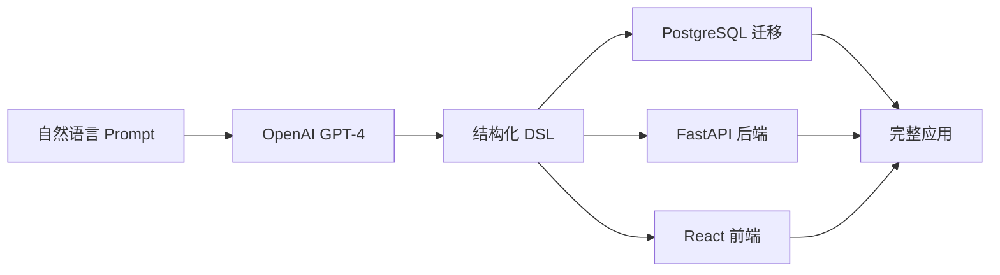

# Base44风格应用生成器

> 🚀 一句话生成完整的Web应用 - 从想法到可运行的代码，只需几分钟！

这是一个受[Base44](https://base44.com)启发的应用生成器，能够将自然语言描述转换为完整的全栈Web应用，包括数据库设计、后端API和现代化前端界面。

## ✨ 核心特性

- 📝 **自然语言输入**：用简单的中文描述你想要的应用
- 🌐 **可视化Web界面**：现代化GUI界面，支持实时进度显示和模板选择
- 🔄 **完整流程**：Prompt → DSL → PostgreSQL + FastAPI + React
- 🎨 **现代化UI**：自动生成基于Tailwind CSS的响应式界面
- 📋 **智能模板系统**：6个预设应用模板，涵盖常见业务场景
- 🗄️ **智能数据建模**：自动设计数据库表结构和关系
- 🔗 **RESTful API**：生成标准的CRUD接口和文档
- 📦 **一键部署**：包含Docker配置，开箱即用
- 🛠️ **可定制化**：基于DSL的架构，支持后续修改和扩展

## 🏗️ 技术架构



### 技术栈

- **AI模型**: OpenAI GPT-4 Turbo
- **数据库**: PostgreSQL 15+
- **后端**: FastAPI + SQLAlchemy + Pydantic
- **前端**: React 18 + TypeScript + Tailwind CSS + Vite
- **部署**: Docker + Docker Compose

## 🎨 Web GUI 界面预览

我们提供了现代化的Web界面，让应用生成变得更加直观和高效！

```bash
npm run web
# 访问 http://localhost:3001
```

### 🌟 界面特色
- **📋 预设模板**：博客、电商、CRM等6种常用模板
- **✍️ 智能输入**：自然语言需求描述，自动生成应用名称
- **📊 实时进度**：WebSocket实时显示生成过程和详细日志  
- **🎯 一键生成**：从需求描述到完整应用，几分钟搞定
- **📱 响应式设计**：支持桌面和移动设备
- **🎨 现代设计**：Tailwind CSS + 渐变背景 + 动画效果

### 🚀 使用流程
1. 选择预设模板或自定义需求
2. 点击"开始生成应用"
3. 实时观察生成进度
4. 获得完整的可运行Web应用

---

## 🚀 快速开始

### 1. 安装依赖

```bash
npm install
```

### 2. 配置OpenAI API密钥

创建 `.env` 文件：

```bash
OPENAI_API_KEY=your_openai_api_key_here
```

### 3. 启动Web GUI界面（推荐）

```bash
# 启动可视化Web界面
npm run web
```

访问 **http://localhost:3001** 即可开始使用！

🎨 **GUI界面特性**：
- 📋 **预设模板**：6个常用应用模板一键选择
- ✍️ **智能输入**：自然语言需求描述
- 📊 **实时进度**：WebSocket显示生成过程
- 🎯 **一键生成**：从想法到完整应用几分钟搞定

### 4. 或使用命令行模式

```bash
# 运行演示
npm run demo

# 使用自然语言描述生成应用
npm run gen-app "创建一个任务管理系统，包含项目、任务、用户三个模块"

# 指定输出目录
npm run gen-app "个人博客系统，包含文章、分类、评论" --output ./my-blog

# 从DSL文件生成
npm run gen-app --from-dsl ./my-app.dsl.json --output ./generated-app
```

### 5. 启动生成的应用

```bash
cd generated-app

# 使用Docker（推荐）
docker-compose up -d

# 或手动启动
cd backend && pip install -r requirements.txt && python main.py &
cd ../frontend && npm install && npm run dev
```

> 💡 **需要更详细的部署指南？** 请查看 [**部署使用指南**](DEPLOYMENT.md)，包含Docker部署、生产环境配置、故障排除等完整内容。

## 📖 详细使用指南

### 🌐 Web GUI 使用指南

#### 启动Web界面

```bash
npm run web
```

界面启动后，访问 **http://localhost:3001** 即可看到现代化的应用生成界面。

#### 界面功能介绍

**左侧 - 预设模板区域**：
- 📱 **个人博客系统**：包含文章、评论、分类管理
- ✅ **待办事项管理**：简单高效的任务管理应用  
- 🛒 **电商管理系统**：商品和订单管理后台
- 👥 **客户关系管理**：CRM系统模板
- 📦 **库存管理系统**：商品库存和入出库管理
- 🎉 **活动管理系统**：活动组织和参与者管理

**右侧 - 应用创建区域**：
- 📝 **需求描述**：用自然语言详细描述你的应用需求
- 🏷️ **应用名称**：系统会智能生成，也可手动修改
- ⚙️ **高级选项**：数据库模式、API端口等配置

#### 使用步骤

1. **选择模板**（可选）：点击左侧任意模板卡片自动填充需求
2. **描述需求**：在右侧输入框详细描述你的应用功能
3. **确认配置**：检查应用名称和高级选项
4. **开始生成**：点击"开始生成应用"按钮
5. **实时观察**：通过WebSocket实时查看生成进度
6. **获取应用**：生成完成后获得完整的可运行应用

#### GUI优势

- 🎨 **直观可视**：无需记忆命令行参数
- 📊 **实时反馈**：可视化进度条和详细日志
- 🚀 **快速上手**：模板系统降低使用门槛
- 💡 **智能提示**：自动生成应用名称和参数建议

> 💡 **提示**：更详细的GUI使用说明请查看 [**GUI使用指南**](GUI使用指南.md)

### 🖥️ 命令行使用指南

#### 输入格式示例

生成器能理解多种自然语言描述格式：

```bash
# 简单描述
npm run gen-app "订阅支出追踪器"

# 详细字段说明
npm run gen-app "创建电商系统：用户(姓名text,邮箱email,手机text)，商品(名称text,价格number,描述textarea,是否上架boolean)，订单(订单号text,总金额number,状态text,创建时间date)"

# 包含业务逻辑
npm run gen-app "学生选课系统，包含学生管理、课程管理、选课记录，需要显示每个学生的选课情况和每门课的选课人数"
```

### 📋 可用命令总览

| 命令 | 功能 | 推荐度 |
|------|------|--------|
| `npm run web` | 🌟 启动Web GUI界面 | ⭐⭐⭐⭐⭐ |
| `npm run demo` | 运行完整功能演示 | ⭐⭐⭐⭐ |
| `npm run gen-app` | 命令行生成应用 | ⭐⭐⭐ |
| `npm run build` | 构建TypeScript代码 | ⭐⭐ |

> 💡 **推荐**：首次使用建议从 `npm run web` 开始，通过可视化界面体验功能！

### CLI选项

```bash
Usage: npm run gen-app [options] <prompt|--from-dsl>

Options:
  --from-dsl <file>     从DSL文件生成应用
  --output <dir>        输出目录 (默认: ./generated-app)
  --schema <name>       数据库schema名称 (默认: public)
  --api-key <key>       OpenAI API密钥（覆盖环境变量）

Examples:
  npm run gen-app "创建博客系统"
  npm run gen-app --from-dsl ./blog.dsl.json
  npm run gen-app "任务管理" --output ./task-app --schema task_schema
```

## 🎯 生成流程详解

### 第一步：Prompt → DSL

使用OpenAI GPT-4将自然语言转换为结构化的DSL（领域特定语言）：

```json
{
  "name": "个人博客系统",
  "description": "简单的博客管理平台",
  "entities": [
    {
      "name": "post",
      "displayName": "文章",
      "columns": [
        {"name": "title", "type": "text", "required": true},
        {"name": "content", "type": "textarea", "required": true},
        {"name": "published", "type": "boolean", "required": false}
      ]
    }
  ],
  "pages": [
    {"name": "post-list", "type": "list", "entity": "post"},
    {"name": "post-form", "type": "form", "entity": "post"}
  ]
}
```

### 第二步：DSL → PostgreSQL

自动生成数据库迁移脚本：

```sql
CREATE TABLE post (
  "id" VARCHAR(255) DEFAULT gen_random_uuid() NOT NULL,
  "title" VARCHAR(255) NOT NULL,
  "content" TEXT NOT NULL,
  "published" BOOLEAN DEFAULT FALSE NULL,
  "created_at" TIMESTAMPTZ DEFAULT CURRENT_TIMESTAMP NOT NULL,
  "updated_at" TIMESTAMPTZ DEFAULT CURRENT_TIMESTAMP NOT NULL,
  CONSTRAINT pk_post PRIMARY KEY (id)
);
```

### 第三步：DSL → FastAPI

生成完整的后端API：

```python
@router.get("/", response_model=List[Post])
def get_posts(skip: int = 0, limit: int = 100):
    """获取文章列表"""
    return fake_posts[skip : skip + limit]

@router.post("/", response_model=Post)
def create_post(post: PostCreate):
    """创建新文章"""
    # 生成CRUD逻辑
```

### 第四步：DSL → React

生成现代化的前端界面：

```tsx
export default function PostList() {
  const { data: posts = [] } = useQuery('posts', postService.getAll)
  
  return (
    <div className="space-y-6">
      {/* 自动生成的列表界面 */}
    </div>
  )
}
```

## 🎨 生成的应用特性

### 后端特性

- ✅ RESTful API设计
- ✅ 自动生成Pydantic模型
- ✅ 请求验证和错误处理
- ✅ OpenAPI文档（/docs）
- ✅ CORS配置
- ✅ 数据库连接管理
- ✅ 环境变量配置

### 前端特性

- ✅ 响应式设计（移动端适配）
- ✅ 现代化UI组件
- ✅ 数据状态管理（React Query）
- ✅ 路由配置
- ✅ 表单验证
- ✅ 搜索和过滤功能
- ✅ 加载状态和错误处理

### 数据库特性

- ✅ 标准化表结构
- ✅ 主键和外键约束
- ✅ 索引优化
- ✅ 时间戳字段
- ✅ 数据验证约束

## 📁 项目结构

生成的应用具有以下结构：

```
generated-app/
├── backend/                    # FastAPI后端
│   ├── main.py                # 应用入口
│   ├── database.py            # 数据库配置
│   ├── models/                # Pydantic模型
│   │   ├── __init__.py
│   │   └── post.py
│   ├── routers/               # API路由
│   │   ├── __init__.py
│   │   └── post_router.py
│   ├── requirements.txt       # Python依赖
│   └── Dockerfile
├── frontend/                  # React前端
│   ├── src/
│   │   ├── components/        # 可复用组件
│   │   ├── pages/            # 页面组件
│   │   │   └── PostList.tsx
│   │   ├── services/         # API服务
│   │   │   └── postService.ts
│   │   ├── App.tsx           # 主应用组件
│   │   ├── main.tsx          # 入口文件
│   │   └── index.css         # 样式文件
│   ├── package.json
│   ├── vite.config.ts
│   ├── tailwind.config.js
│   └── Dockerfile
├── migration.sql             # 数据库迁移脚本
├── docker-compose.yml        # Docker配置
├── dsl.json                 # 应用结构定义
└── README.md                # 应用说明文档
```

## 🔧 高级用法

### 1. DSL定制

你可以手动编辑生成的 `dsl.json` 文件，然后重新生成：

```json
{
  "entities": [
    {
      "name": "user",
      "displayName": "用户",
      "columns": [
        {"name": "username", "type": "text", "required": true, "unique": true},
        {"name": "email", "type": "email", "required": true, "unique": true},
        {"name": "avatar", "type": "url", "required": false}
      ]
    }
  ]
}
```

```bash
npm run gen-app --from-dsl ./modified-dsl.json --output ./updated-app
```

### 2. 多租户支持

使用不同的schema为每个租户生成独立的应用：

```bash
npm run gen-app "客户管理系统" --schema tenant_001 --output ./tenant-001-app
npm run gen-app "客户管理系统" --schema tenant_002 --output ./tenant-002-app
```

### 3. 增量更新

当需要添加新功能时，修改DSL并重新生成，然后合并代码变更。

## 🎯 示例应用

### 1. 博客系统

```bash
npm run gen-app "个人博客系统，包含文章管理、分类管理、评论系统，支持文章发布状态控制" --output ./blog-app
```

特性：文章CRUD、分类管理、评论审核、发布控制

### 2. 任务管理

```bash
npm run gen-app "项目任务管理系统：项目(名称text,描述textarea,状态text)，任务(标题text,描述textarea,优先级text,状态text,截止日期date,分配用户text)" --output ./task-app
```

特性：项目管理、任务分配、状态跟踪、截止日期提醒

### 3. 电商后台

```bash
npm run gen-app "简单电商管理后台：商品(名称text,价格number,库存number,描述textarea,是否上架boolean)，订单(订单号text,用户text,总金额number,状态text)" --output ./ecommerce-admin
```

特性：商品管理、库存控制、订单处理、销售统计

## 🔍 运行演示

项目包含完整的演示：

```bash
# 运行内置演示
npm run demo

# 或直接运行演示文件
npx tsx demo.ts
```

演示将生成：
- 订阅管理应用（需要OpenAI API）
- 博客系统应用（预定义DSL）
- SQL迁移脚本示例

## 🛠️ 开发和扩展

### 项目架构

```
src/
├── types/
│   └── dsl.ts              # DSL类型定义
├── modules/
│   ├── prompt-to-dsl.ts    # 自然语言→DSL转换
│   ├── dsl-to-sql.ts       # DSL→PostgreSQL转换
│   ├── dsl-to-api.ts       # DSL→FastAPI转换
│   └── dsl-to-ui.ts        # DSL→React转换
└── cli.ts                  # 命令行界面
```

### 扩展指南

1. **添加新的字段类型**：修改 `types/dsl.ts` 和各个转换器
2. **支持新的数据库**：创建新的SQL生成器
3. **添加UI组件库**：修改UI生成器模板
4. **集成新的AI模型**：替换prompt-to-dsl中的OpenAI调用

## 📊 对比Base44

| 特性 | Base44 | 本项目 |
|------|--------|--------|
| **核心理念** | 闭源SaaS平台 | 开源自部署 |
| **技术栈** | 专有技术 | 主流开源技术 |
| **定制性** | 有限 | 完全可定制 |
| **部署** | 托管服务 | 自主部署 |
| **成本** | 订阅费用 | 免费使用 |
| **数据控制** | 平台托管 | 完全自控 |

## 🤝 贡献指南

欢迎提交Issue和Pull Request！

### 开发环境设置

```bash
git clone <repo-url>
cd base44-generator
npm install
npm run build
npm test
```

### 贡献方向

- 🔄 添加更多AI模型支持（Claude、Gemini等）
- 🎨 增强UI组件和主题
- 🗄️ 支持更多数据库（MySQL、MongoDB等）
- 📱 移动端应用生成
- 🔐 权限和认证系统
- 📈 数据分析和报表功能

## 📝 许可证

MIT License - 详见 [LICENSE](LICENSE) 文件

## 📚 详细文档

- 📖 **[部署使用指南](DEPLOYMENT.md)** - 完整的安装配置和部署指南
- 🎨 **[GUI使用指南](GUI使用指南.md)** - Web界面使用说明
- ✅ **[验证报告](验证报告.md)** - 功能验证和测试结果

## 🙏 致谢

- 感谢 [Base44](https://base44.com) 提供的灵感
- 感谢 OpenAI 提供的强大AI能力
- 感谢所有开源项目的贡献者

---

🚀 **开始创建你的第一个应用吧！只需要一句话描述，几分钟后就能看到完整的Web应用。**

如果你觉得这个项目有用，请给它一个 ⭐ Star！ 